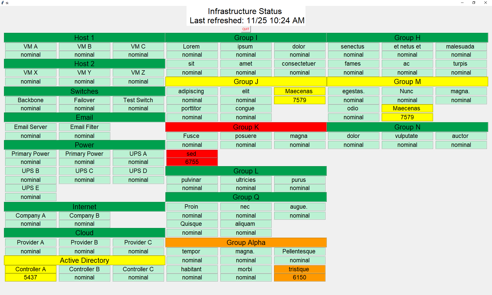

# infrastructure_dashboard
A status board for infrastructure created for IT support environments that includes some manual and automatic update functionality.

This was designed with the following scenerio in mind. A IT Director or Manager wants to have a high level understanding of the status of infrastructure in their environment. They also want their staff to see it and know that it is looked at frequently. The Director wants it to be quick to grasp, easy to update, but not necessary to micromanage. So - this program runs on a digital sign.

# Files
|File      | Description|
|----------|------------------------------------------------------------------------------------------------------------------------|
|README.md|This document|
|infrastructure_dashboard.py|The main code - runs the GUI. This is what you will actually run. It basically displays what load_tables.py finds in a GUI.|
|getreminders.py|Interfaces with a ticketing system to pull info about specific tickets.|
|load_tables.py|Interfaces with getreminders.py, infrastructure.csv, and tickets.csv to do virtually all of the data manipulation for the program.|
|infrastructure.csv|A csv where you will put your infrastructure to be displayed.|
|tickets.csv|A csv where you will put specific tickets tied to specific infrastructure that the dashboard should watch.|

# How to set up in a new environment
## A. Adjust infrastructure.csv
The program will pull infrastructure from infrasructure.csv. You need to add your infrastructure to watch to that file. Add each item to be listed on the dashboard one at a time. The header "infrastructure_item" will be what is shown on the dashboard. The heading "infrastructure_group" will be how the dashboard groups infrastructure items together. If you want things to be shown in the same group, they need to have the same infrastructure group text, and be sorted to be next to eachother in infrastructure.csv
## B. Add your URL and API Key
This program is designed to watch your ticketing system for updates to certain tickets to be discussed later. This was originally designed around the ManageEngine Service Desk API (https://www.manageengine.com/api/). 
  i. If you use ManageEngine, simply update your URL and TECHNICIAN_KEY found in getreminders.py to your appropriate setting.
  ii. If you don't use ManageEngine, the function getTicketInfo() in getreminders.py should be adjusted to your ticketing system API. It could also be adjusted to not check a ticketing system if you are not interested in the dashboard automatically updating.
## C . Adjust tickets.csv
The automatic update feature of this program works by an individual specifying a ticket that is associated with an issue that is associated with a specific piece of infrastructure. Once set, the dashboard will display the issue or outage on the dashboard until the ticket is marked "resolved" or "closed", so the manager doesnt have to micromanage to see a high level view of the infrastructure. Additionally, if that ticket re-opens, the dashboard will automatically update as well. That is helpful for issues that can be updated from events (For example: An email alert of resource issues on a specific VM is configured to be forwarded to the ticketing system where it automatically updates a specific ticket, pulling it out of resolved).
## D. Navigate to the path and enter "python infrastructure_dashboard.py" in powershell or cmd
